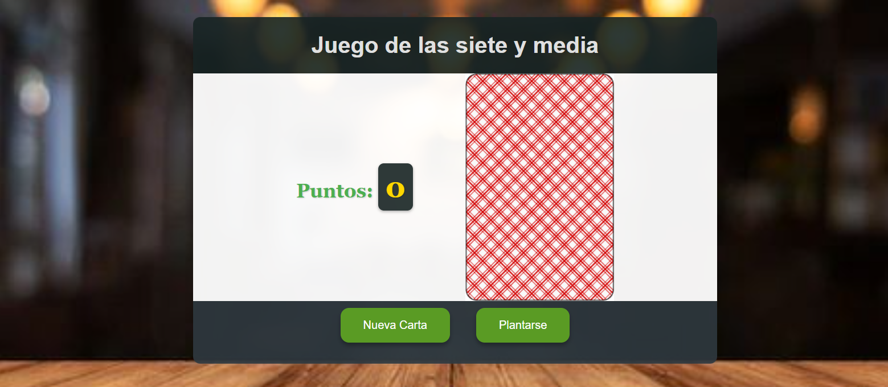

# Proyecto: Siete y Media

## Enunciado
Este proyecto consiste en implementar el juego "Siete y Media", donde los jugadores pueden pedir cartas y sumar puntos, tratando de no superar 7.5.

## Requisitos Implementados

### 1. Mostrar Puntuación
- Se creó una variable `puntuacion` para almacenar la puntuación del usuario, inicializándola en 0.
- Se añadió un `div` en el HTML para mostrar la puntuación.
- Implementé la función `muestraPuntuacion`, que actualiza el `div` con la puntuación actual. Esta función se invoca al cargar el DOM.

### 2. Pedir Carta
- Se generó la función `dameCarta`, que devuelve una carta aleatoria.
- Se añadió un botón en el HTML que llama a `dameCarta` al pulsarlo, mostrando la carta en la consola.
- Para evitar los valores 8 y 9, se generó un número aleatorio entre 1 y 10 y se ajustaron los valores mayores a 7.

### 3. Mostrar Carta
- Implementé la función `mostrarCarta(carta: number): void`, que muestra la carta elegida.
- Se añadió un elemento `` en el HTML con una imagen de carta boca abajo. Utilicé un `switch` para mapear el valor de la carta a su respectiva imagen.

### 4. Sumar Puntuación
- Después de mostrar la carta, se suma el valor de la carta a la variable `puntuacion`.
- Se invoca `muestraPuntuacion` para actualizar la puntuación en pantalla.

### 5. Game Over
- Se implementó una lógica que verifica si la puntuación supera 7.5, mostrando un mensaje de "Game Over" y deshabilitando la opción de pedir más cartas.

### 6. Me Planto
- Se añadió un botón para que el usuario se plante.
- Dependiendo de la puntuación, se muestra un mensaje específico:
  - Menor que 4: "Has sido muy conservador."
  - 5: "Te ha entrado el canguelo eh?"
  - 6 o 7: "Casi casi..."
  - 7.5: "¡Lo has clavado! ¡Enhorabuena!"

### 7. Nueva Partida
- Al finalizar la partida, se muestra un botón que permite al usuario iniciar una nueva partida.

### 8. Estilo de la Aplicación
- Se aplicó CSS para estilizar la aplicación, añadiendo fondo, mejorando márgenes, espacios y colores.

## Apartado Opcional
- Se implementó un botón que permite al usuario ver qué habría pasado si hubiera seguido pidiendo cartas tras plantarse.

## Imagen
