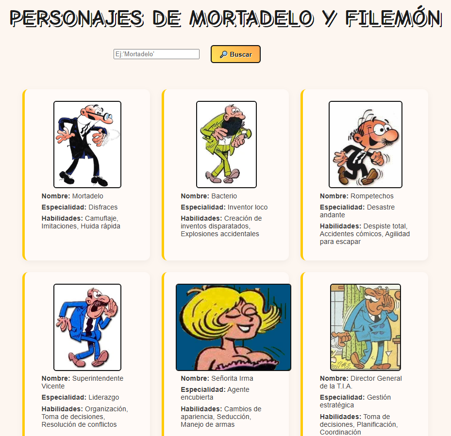

# Laboratorio Módulo 10 - Asincronía

Este proyecto es una práctica del módulo 10 centrada en el uso de asincronía con TypeScript.  
La aplicación permite buscar personajes del universo de Mortadelo y Filemón a través de una API local, con una interfaz simple y muy... "cómica".

---

## Objetivos del ejercicio

- Mostrar un listado completo de personajes al cargar la página.
- Permitir al usuario buscar personajes por nombre (o parte del nombre) usando un formulario.
- Mostrar los resultados filtrados de forma dinámica, sin recargar la página.

---

## Funcionalidades implementadas

- Al iniciar la app se muestran todos los personajes disponibles en la base de datos.
- El usuario puede escribir un texto en el buscador y pulsar el botón "Buscar" para filtrar personajes.
- El filtrado se aplica de forma inmediata, sin reload.
- Las imágenes se cargan desde el backend local (`/public`) añadiendo la ruta completa al `src`.

---

## Estructura del proyecto

- `/src/index.html` – Contiene la estructura básica del formulario y del listado de resultados.
- `/src/style.css` – Estilo personalizado con tipografía tipo cómic para mantener el tono humorístico.
- `/src/personajes/`
  - `personajes.ts` – Lógica de renderizado y gestión de eventos.
  - `personajes.api.ts` – Comunicación con la API mediante `axios`.
  - `personajes.model.ts` – Tipado de los datos en TypeScript.

---

## Dificultades encontradas y mejoras adicionales

Durante el desarrollo surgieron algunos pequeños imprevistos:

- Dos personajes (`Ofelia` y `Filemón`) estaban en la carpeta `/public`, pero **no aparecían en la base de datos** (`db.json`).  
  ➤ Se añadieron manualmente para que todo el equipo estuviera presente en la fiesta.

Además, se implementaron pequeñas mejoras para que la experiencia fuese más amigable:

- Se añadió un botón extra: **"🔄 Ver Todos"**
  - Permite restaurar el listado completo tras una búsqueda.
  - Solo aparece si el usuario ha filtrado algo.
  - Se oculta automáticamente cuando ya no es necesario.

---

## Tests

También se han añadido tests usando [Vitest](https://vitest.dev/), porque aunque sea un cómic, esto va en serio 😎

### Ficheros testeados

- `personajes.api.ts`  
  - ✅ Devuelve correctamente los datos cuando la API responde bien.  
  - ❌ Lanza un error si la API falla.
  
## Vista previa

