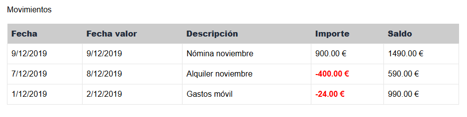

# Laboratorio Módulo 13.1 - React Movimientos

Este ejercicio corresponde al módulo 13.1 del Bootcamp y tiene como objetivo construir una pantalla en React para mostrar los movimientos bancarios de una cuenta. El proyecto se basa en un ejemplo previo del Bootcamp, que se ha ampliado para consumir datos reales desde un servidor local (`json-server`) y mejorar su maquetación y funcionalidad.

## Objetivo

Crear una vista que muestre los movimientos de una cuenta bancaria, accediendo a los datos a través de una API REST. Además de la integración de datos, se buscó replicar el diseño visual entregado, manteniendo una estructura de carpetas clara y un uso correcto del layout de la aplicación.

## Funcionalidades implementadas

- Página de movimientos accesible mediante una ruta dinámica: `/movements/:id`.
- Uso del layout principal con cabecera, navegación y pie de página.
- Carga de datos desde dos endpoints:
  - Información de la cuenta (`/account-list/:id`)
  - Detalle de movimientos (`/movements?accountId=1`)
- Integración de `useParams` para obtener el parámetro dinámico desde la URL.
- Llamadas a la API gestionadas con Axios.
- Uso de un ViewModel (`MovementVm`) y un mapper para transformar los datos recibidos.
- Tabla estilizada con:
  - Líneas alternas para mejorar la lectura
  - Colores personalizados y celdas con bordes
  - Soporte para valores negativos con estilos diferenciados
- Diseño responsive con scroll horizontal cuando es necesario.
- Separación modular del código en carpetas por responsabilidad.

## Endpoint utilizado

```
GET http://localhost:3000/movements?accountId=1
```

### Ejemplo de llamada con Axios

```ts
import Axios from "axios";
import { Movement } from "./movements.api-model";

const urlMovements = \`\${import.meta.env.VITE_BASE_API_URL}/movements\`;

export const getMovements = (accountId: string): Promise<Movement[]> =>
  Axios.get<Movement[]>(urlMovements, { params: { accountId } }).then(
    ({ data }) => data
  );
```

## ViewModel utilizado

```ts
export interface MovementVm {
  id: string;
  description: string;
  amount: string;
  balance: string;
  date: string;
  valueDate: string;
}
```

## Resultado visual

Se replicó correctamente la interfaz de movimientos mostrada en el ejemplo del profesor.  
La tabla presenta los movimientos con fechas y valores formateados, y el diseño general sigue los estilos del layout base de la app.


