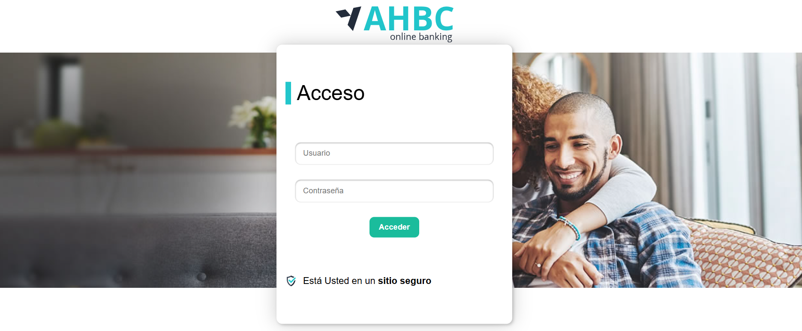
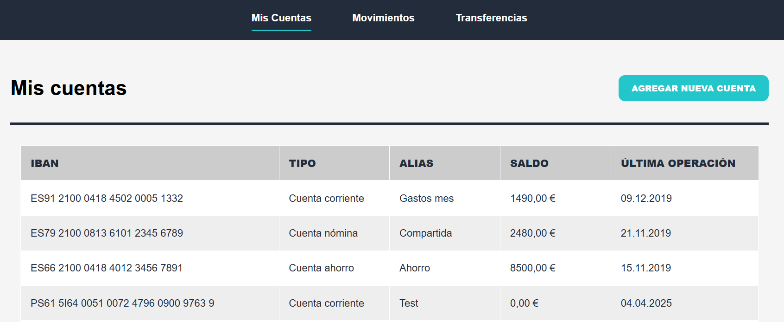

# Laboratorio Módulo 13.2 - React: Agregar Cuenta

Este ejercicio pertenece al módulo 13.2 del Bootcamp de JavaScript. El objetivo principal fue permitir que un usuario pudiera agregar una cuenta bancaria desde la aplicación, utilizando React y una API simulada con `json-server`.

El trabajo consistió en crear una vista de formulario conectada al backend mock, hacer validaciones básicas y asegurarse de que, una vez enviada la cuenta, el usuario fuera redirigido al listado de cuentas actualizado. También se prestó atención al diseño visual para mantener la coherencia con el resto de la app.

## Objetivo

Permitir que el usuario agregue una nueva cuenta bancaria, eligiendo su tipo (corriente o ahorro) e ingresando un alias, y enviar esos datos al servidor. El servidor se encarga de generar el IBAN, el balance y la fecha de última transacción.

## Funcionalidades implementadas

- Botón en el listado de cuentas que lleva a la ruta `/create-account`.
- Componente para agregar cuenta, con formulario que incluye:
  - Select de tipo de cuenta (corriente o ahorro).
  - Campo de alias.
- Validaciones:
  - No se puede enviar el formulario si falta alguno de los campos.
- Envío de datos con método `POST` al endpoint de cuentas.
- Redirección automática al listado de cuentas tras el guardado.
- Refresco del listado con la cuenta nueva incluida.
- Uso del layout principal (`AppLayout`) para mantener diseño consistente.
- IBAN generado por el servidor mock, no es responsabilidad del cliente.
- Diseño responsive para móviles y escritorio.

## Desarrollo y dificultades encontradas

Una parte clave fue que la cuenta nueva apareciera correctamente en el listado al volver desde el formulario. También fue importante evitar errores comunes al acceder al DOM, usando `instanceof` y control de nulls en lugar de `as`.

Tuve que ajustar los estilos para que todo se vea limpio: evitar tarjetas innecesarias, centrar el botón, distribuir los campos con buen espaciado, y que el formulario se adaptara bien a distintos tamaños de pantalla.

Validar el formulario sin depender de coerciones también fue parte del aprendizaje, usando buenas prácticas para mantener el código seguro y predecible.

## Mejoras aplicadas

- Validaciones sin `as` ni `!`, usando `instanceof` y control de tipos.
- Limpieza de imports no usados.
- Uso correcto de `useState` para controlar campos del formulario.
- Separación por carpetas con componentes reutilizables.
- Diseño responsive tanto en la tabla como en el formulario.


## Página de acceso

Antes de poder crear o visualizar cuentas, el usuario debe iniciar sesión.  
Se creó una página de acceso en la ruta:

```
http://localhost:5173/
```

### Credenciales disponibles

- **Email:** admin@email.com  
- **Contraseña:** test


## Resultado visual

### Acceso al sistema



### Lista de cuentas con cuenta agregada


